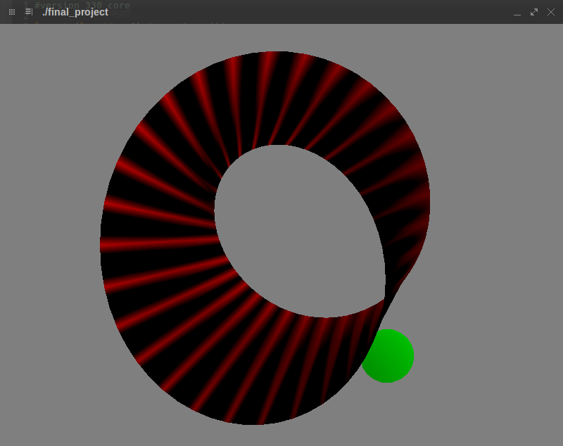

# Final Project Submission

## Requirements

* OpenGL 3.3+
* libglew1.10
* libglm
* freeglut3
* libglew1.10
* libglu1

## Installation

Run:
```sh
cmake .
make
```

The resulting binary is called `final_project`.

## Usage

It is possible to interact with the program in the following ways:

* Mouse has trackball-style rotation when pressing down on the left button
* '+' zooms in and '-' zooms out

## Further description

Project description can be found inside the `description` directory

## Screenshot


